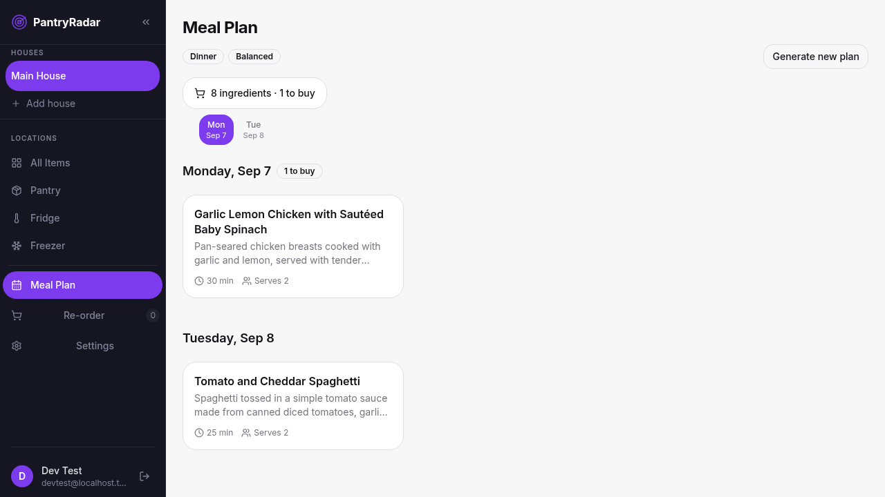
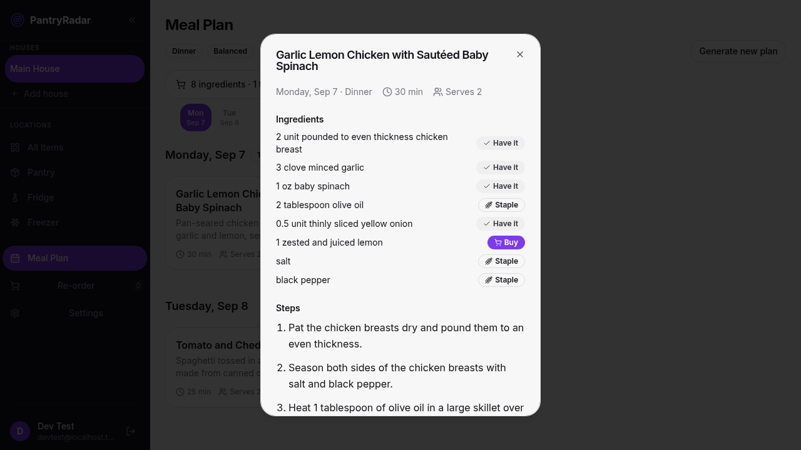
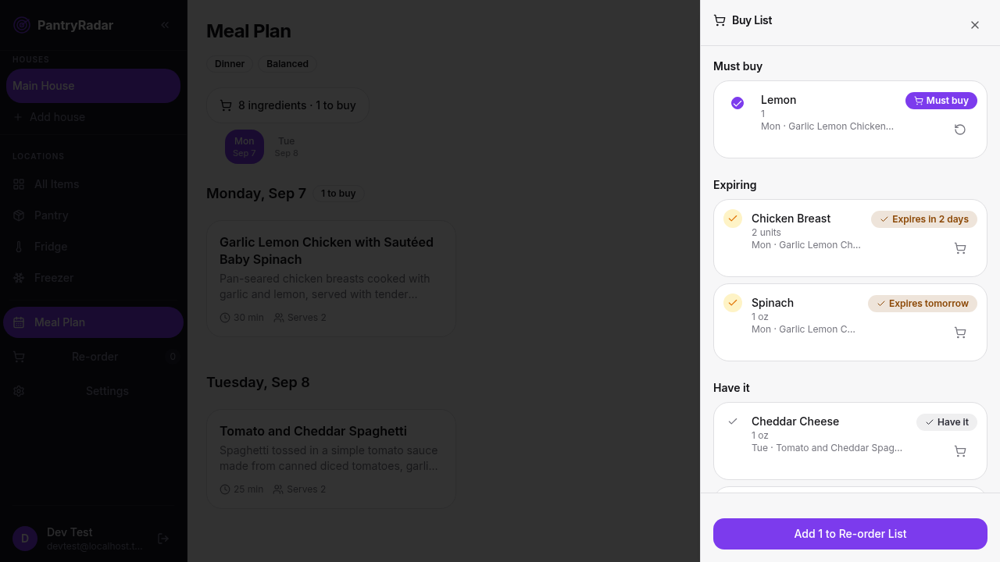
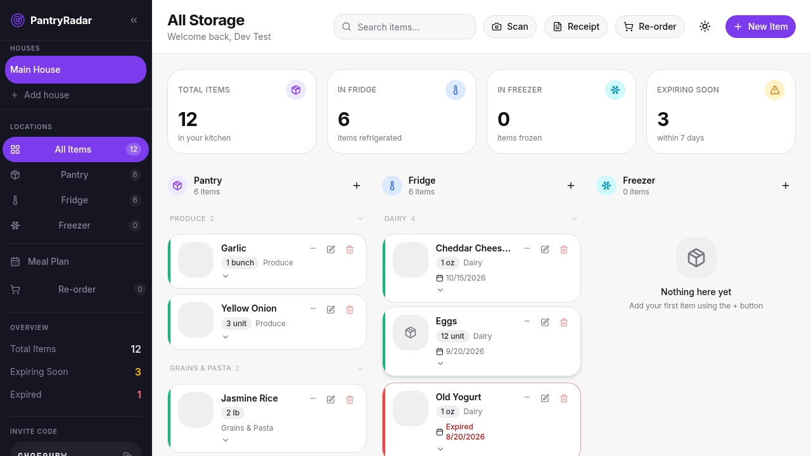
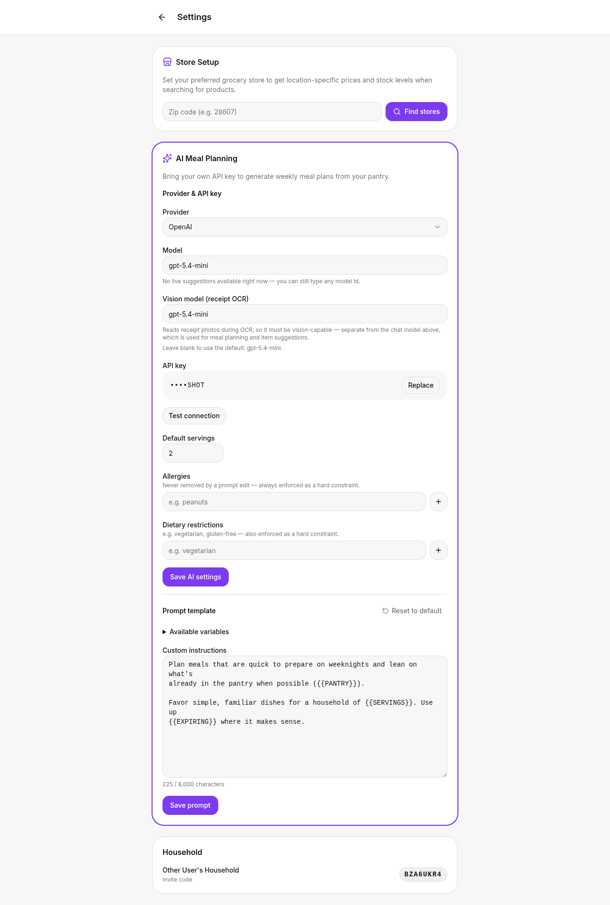

<div align="center">

# PantryRadar

**Know what you have. Know what's about to go off. Know what to cook.**

A self-hosted household inventory app for your pantry, fridge, and freezer — with an
AI meal planner that builds a week of meals from what's actually on your shelves.

[](https://github.com/huh12312/pantryradar/actions/workflows/ci.yml)
[](https://github.com/huh12312/pantryradar/actions/workflows/e2e.yml)
[](https://hub.docker.com/r/masterhuh/pantryradar)

</div>

---

## What it does

Add food by scanning a barcode or photographing a receipt. PantryRadar fills in the
product name, brand, category, an image, and an estimated expiration date. Share the
household with family via an invite code — everyone sees the same inventory.

Then it plans your meals around what you already own.



### The meal planner

Point it at your own LLM API key and it generates a plan from current inventory. You pick
which meal slots to fill, whether to prioritise food that's about to expire, and how many
days to cover.

Crucially, **what you have versus what you need to buy is decided in code, not by the
model.** Ingredients are normalised and matched against your pantry, so the model can't
hallucinate that you're out of onions. Kitchen staples — salt, pepper, oil — are
recognised and never added to your shopping list.



Above: chicken breast in the fridge satisfies a recipe calling for "chicken"; olive oil,
salt and pepper are classified as staples; only the lemon is flagged to buy.

### The buy list

Every ingredient across the plan is aggregated into one list, deduplicated, and grouped by
whether you already have it. One tap pushes the missing items into your shopping list.



Quantities in the same unit are summed. Mixed units render as `2 cups + 1 unit` rather
than inventing a conversion — `items.unit` is free text, so any unit maths would be
fiction.

### Inventory



---

## Features

| | |
|---|---|
| **Barcode scanning** | Open Food Facts lookup → name, brand, category, image |
| **Receipt photos** | Vision-model OCR extracts line items; you review before anything is saved |
| **Expiration tracking** | LLM-estimated shelf life per item, with expiring/expired surfacing |
| **AI meal planning** | Weekly plans from live inventory, expiring-first mode, per-meal regeneration |
| **Deterministic buy list** | Have/buy decided in code, staples excluded, one-tap to shopping list |
| **Multi-household** | 8-character invite codes; strict per-household data isolation |
| **Multiple houses** | Track separate locations (main house, beach house) in one household |
| **Bring your own key** | OpenAI, Anthropic, or OpenRouter — per household or container-wide |
| **Mobile-first** | Responsive down to Pixel 5; accessibility gated in CI with axe |

---

## Quick start (Docker)

**Prerequisites:** Docker + Docker Compose. No checkout required.

```bash
# 1. Get the compose file and env template
curl -O https://raw.githubusercontent.com/huh12312/pantryradar/main/docker-compose.yml
curl -o .env https://raw.githubusercontent.com/huh12312/pantryradar/main/.env.example

# 2. Generate the three required secrets
echo "POSTGRES_PASSWORD=$(openssl rand -base64 24 | tr -d /+=)"
echo "BETTER_AUTH_SECRET=$(openssl rand -base64 32)"
echo "MEAL_PLAN_KEK=$(openssl rand -base64 32)"
# → paste each into .env, replacing the placeholders

# 3. Start
docker compose up -d
```

Open **http://localhost:3000**. Sign up — your household is created automatically.

> [!IMPORTANT]
> All three secrets above are **required**, and the placeholders in `.env.example` are
> deliberately invalid. In particular `MEAL_PLAN_KEK` must decode to exactly 32 bytes —
> the server refuses to store API keys without it rather than falling back to plaintext.
> See [Troubleshooting](#troubleshooting).

Pin a release instead of `latest` in `docker-compose.yml`:

```yaml
image: masterhuh/pantryradar:0.11.0
```

Upgrade with `docker compose pull && docker compose up -d`. Database migrations apply
automatically at boot.

---

## Setting up the LLM

Everything AI-powered — meal planning, receipt OCR, expiration estimates, item
suggestions — runs off **one** credential. There are two ways to supply it.

### Option A — container-wide (simplest)

One key for every household. Set in `.env`:

```bash
LLM_PROVIDER=openai          # openai | anthropic | groq | ollama
LLM_MODEL=gpt-5.4-mini
OPENAI_API_KEY=sk-...
```

No `MEAL_PLAN_KEK` needed for this path — there's nothing to encrypt.

### Option B — per household (bring your own key)

Each household saves its own provider, model, and key in **Settings → AI Meal Planning**.
Keys are encrypted at rest with AES-256-GCM and are never returned by the API.



Model suggestions are fetched **live from your provider**, so newly released models appear
without waiting for an app update. The field stays free-text, so an unlisted model is
never blocked.

The prompt template is editable and appended to a fixed base prompt — allergies and
dietary restrictions are separate first-class fields, so a prompt edit can never silently
delete them.

**Resolution order:** household key → matching env key for that provider → generation
fails with a clear error. A household on Anthropic will not silently fall back to an
`OPENAI_API_KEY`.

---

## Development

**Prerequisites:** Bun 1.x · pnpm 8+ · Node 20+ · Docker

```bash
git clone https://github.com/huh12312/pantryradar.git
cd pantryradar
pnpm install

cp .env.example .env          # fill in the three secrets above

docker compose up -d postgres # database only; API runs from source
pnpm dev                      # web :5173 + API :3000, both hot-reloading
```

> [!NOTE]
> `docker-compose.yml` does not publish Postgres to the host. To run the API from source
> against it, add a `docker-compose.override.yml` (gitignored):
> ```yaml
> services:
>   postgres:
>     ports: ["5432:5432"]
> ```

### Commands

```bash
pnpm dev        # web + API dev servers
pnpm build      # build everything
pnpm lint       # ESLint across all packages
pnpm format     # Prettier
```

| Scope | Command | Notes |
|---|---|---|
| Server unit | `cd server && bun test src/test/lib` | Pure logic, no DB required |
| Server routes | `cd server && bun run test:integration` | Testcontainers — needs Docker |
| Server live LLM | `cd server && bun run test:live` | **Manual only**, needs a real API key |
| Web | `cd apps/web && pnpm test` | Vitest + MSW, coverage gated |
| Shared | `cd packages/shared && pnpm test` | Zod contract tests, 90% threshold |
| E2E | `pnpm test:e2e` | Playwright, needs API + web running |

Server tests run from the `server/` directory — the migration journal path is relative.

---

## Architecture

```
Browser (desktop + mobile web)
      │
      ▼
Caddy (production) / Vite dev proxy (:5173)
      │
      ▼
Hono API on Bun (:3000)
  ├── Better Auth        session cookies, email/password
  ├── Drizzle ORM        PostgreSQL 16, migrations applied at boot
  ├── LLM layer          Vercel AI SDK — per-household or container-wide credentials
  ├── Meal-plan worker   two-phase generation, in-process, DB-backed status
  └── Image resolver     Wikipedia → Pexels fallback (fire-and-forget)
```

All API responses share one envelope:

```json
{ "success": true, "data": {}, "error": null }
```

### How a meal plan is generated

1. `POST /api/meal-plans` returns **202** immediately with a plan id.
2. A background worker generates a **skeleton** (one call), then **one call per meal** at
   concurrency 4. One failed recipe marks only that meal failed — the plan stays usable.
3. The client polls `GET /api/meal-plans/:id`, which returns the plan **as far as it has
   been built**, so days appear incrementally.
4. After generation, ingredients are reconciled against live inventory in code to decide
   have/buy/staple.

A partial unique index guarantees one active generation per household, so two family
members hitting Generate at once produce one plan, not two.

### Key routes

| Method | Path | Description |
|---|---|---|
| `GET` | `/health` | Health check (public) |
| `*` | `/api/auth/**` | Better Auth |
| `GET/POST/PUT/DELETE` | `/api/items` | Inventory CRUD |
| `GET` | `/api/barcode/:upc` | Open Food Facts lookup |
| `POST` | `/api/receipt` | Vision-model receipt OCR |
| `GET/PUT` | `/api/settings/llm` | Provider, model, key (write-only) |
| `GET` | `/api/settings/llm/models` | Live model catalogue from the provider |
| `POST/GET` | `/api/meal-plans` | Create / list plans |
| `GET` | `/api/meal-plans/:id` | Full plan + generation status (polling) |
| `POST` | `/api/meal-plans/:id/shopping/commit` | Push buy list to shopping list |

Every data route is authenticated and filtered by household in the same SQL statement.
Cross-household access returns **404**, never 403 — existence is not confirmed.

---

## Configuration

Full list in [`.env.example`](.env.example). The essentials:

| Variable | Required | Description |
|---|:---:|---|
| `POSTGRES_PASSWORD` | ✅ | Postgres will not start without it |
| `DATABASE_URL` | ✅ | Connection string |
| `BETTER_AUTH_SECRET` | ✅ | `openssl rand -base64 32` |
| `BETTER_AUTH_URL` | ✅ | API base URL |
| `MEAL_PLAN_KEK` | ⚠️ | Required **only** for per-household keys. Exactly 32 bytes, base64 |
| `MEAL_PLAN_KEK_PREVIOUS` | | Decrypt-only fallback during key rotation |
| `LLM_PROVIDER` / `LLM_MODEL` | | Container-wide default provider and model |
| `LLM_VISION_MODEL` | | Vision model for receipt OCR |
| `OPENAI_API_KEY` etc. | | Container-wide key for the matching provider |
| `PEXELS_API_KEY` | | Optional — stock-photo fallback for item images |
| `SIGNUP_ENABLED` | | Set `false` to close registration after your household is set up |
| `DOMAIN` / `SSL_MODE` | | Production domain; `internal` (dev) or `auto` (Let's Encrypt) |

---

## Maintenance

### Backups

Two things matter, and **both** are needed to restore a working system:

```bash
# 1. The database
docker compose exec -T postgres pg_dump -U pantrymaid pantrymaid | gzip > backup-$(date +%F).sql.gz

# 2. Your .env — specifically MEAL_PLAN_KEK
```

> [!WARNING]
> A database backup **without** `MEAL_PLAN_KEK` cannot decrypt stored API keys. That's by
> design — the dump alone is not enough to steal credentials — but it means losing the KEK
> means every household must re-enter their key. Back it up like any other production
> secret, separately from the database.

Restore:

```bash
gunzip -c backup-2026-09-05.sql.gz | docker compose exec -T postgres psql -U pantrymaid pantrymaid
```

### Rotating the encryption key

```bash
# 1. Move the current key to the fallback slot, generate a new one
MEAL_PLAN_KEK_PREVIOUS=<old key>
MEAL_PLAN_KEK=$(openssl rand -base64 32)

# 2. Recreate the container
docker compose up -d --force-recreate api
```

Existing keys decrypt with the previous KEK and re-encrypt under the new one as households
save. Once every household has re-saved, remove `MEAL_PLAN_KEK_PREVIOUS`.

### Upgrading

```bash
docker compose pull
docker compose up -d
```

Migrations run automatically at boot and are idempotent. Take a database backup first for
any release that adds migrations — the release notes say when it does.

### Controlling LLM spend

- Set `monthlyTokenCap` per household to hard-stop generation past a budget.
- Generation is rate-limited per household (hourly and daily), persisted in Postgres so a
  restart doesn't reset it.
- Each plan records its token usage; the plan header shows model and approximate cost.
- Prefer a smaller model — `gpt-5.4-mini` produces good plans for a fraction of the cost.

### Closing registration

After your household is set up, set `SIGNUP_ENABLED=false` and recreate the container.
Existing users are unaffected; new sign-ups are rejected. Family members join with the
household invite code instead.

---

## Troubleshooting

<details>
<summary><strong>"Server is not configured to store API keys" when saving a key</strong></summary>

`MEAL_PLAN_KEK` is missing or the wrong length. Logs will show
`MEAL_PLAN_KEK is not set. Refusing to encrypt/decrypt secrets` or
`must decode to exactly 32 bytes (got N)`.

```bash
openssl rand -base64 32          # add to .env as MEAL_PLAN_KEK
docker compose up -d --force-recreate api
```

`docker compose restart` is **not** enough — it reuses the old environment. Don't copy the
placeholder from `.env.example`; it decodes to 6 bytes and will fail the same way.

Verify: `docker compose exec api sh -c 'echo ${MEAL_PLAN_KEK:+SET}'`
</details>

<details>
<summary><strong>Postgres container restarts in a loop</strong></summary>

`POSTGRES_PASSWORD` is unset. Postgres refuses to initialise without one. Set it in `.env`
and run `docker compose up -d`.
</details>

<details>
<summary><strong>Meal plan generation fails immediately</strong></summary>

Check the error on the plan:

- **`invalid_api_key`** — the provider rejected the key. Use **Test connection** in
  Settings; it reports the provider's own error.
- **`no_api_key`** — no household key and no matching env key *for that provider*. An
  Anthropic household needs `ANTHROPIC_API_KEY`, not `OPENAI_API_KEY`.
- **`rate_limited`** — the provider is throttling; retry after the stated delay.
- **`internal_error`** — a bug on our side, not the provider. Check the API logs.
</details>

<details>
<summary><strong>Receipt OCR fails but meal planning works</strong></summary>

Your chat model probably isn't vision-capable. Set a vision model in **Settings → Vision
model (receipt OCR)** or `LLM_VISION_MODEL` in `.env`.
</details>

---

## Testing

| Suite | Count |
|---|---|
| Server unit | 217 |
| Server routes (testcontainers) | 149 |
| Web (Vitest + MSW) | 382 |
| Shared schema contracts | 124 |
| E2E (Chromium + Pixel 5) | 70 |

Accessibility is enforced in CI: `e2e/a11y.spec.ts` runs axe (WCAG 2 A/AA) against every
major screen on both desktop and mobile viewports and asserts **zero violations**.

No test ever makes a real LLM call. A global preload replaces the model seam with a
thrower, so a suite that forgets to stub fails loudly instead of billing an account.

---

## Releasing

Tagging a `v*` release builds and publishes the Docker image, gated on CI and E2E passing:

```bash
gh release create v0.12.0 --title "v0.12.0 — Title" --notes "..."
```

| Workflow | Trigger | Does |
|---|---|---|
| `ci.yml` | push / PR | Lint, build, unit tests |
| `e2e.yml` | push / PR | Postgres + migrations + Playwright |
| `docker-publish.yml` | `v*` tag | Gated build → `masterhuh/pantryradar` |
| `deploy.yml` | manual | SSH deploy stub |

If the gate fails, no image is published — the tag can be moved to a fixed commit and
re-pushed.

---

## Contributing

Issues and pull requests welcome. Before opening a PR:

```bash
pnpm lint && pnpm build && pnpm test
```

Conventions: TypeScript strict everywhere · Zod validation at every route boundary ·
household isolation enforced in the same SQL statement as the lookup · Prettier
(`semi: true`, double quotes, width 100).

---

## License

> [!NOTE]
> No license has been chosen yet. Under default copyright that means **all rights
> reserved** — others may view the code, but not legally use, modify, fork, or
> redistribute it, and "public" contributions can't be accepted cleanly. If this repo is
> meant to be shared, add a `LICENSE` file (MIT and Apache-2.0 are the usual choices for
> a self-hosted app like this) and replace this note.
